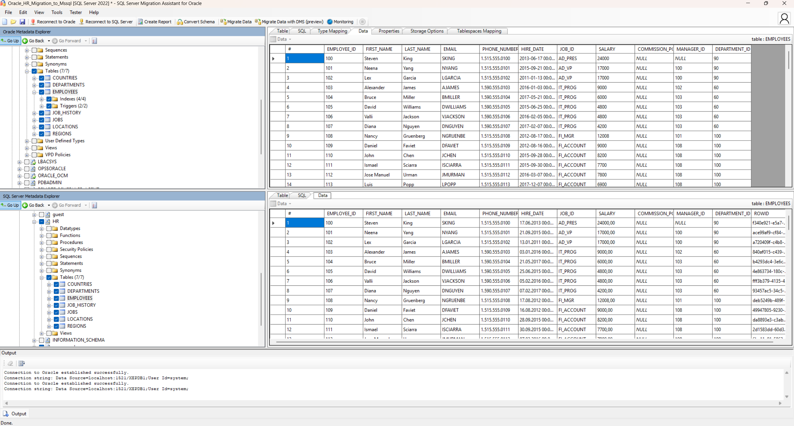
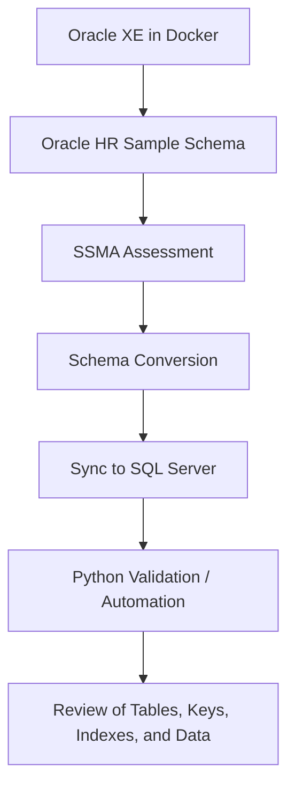
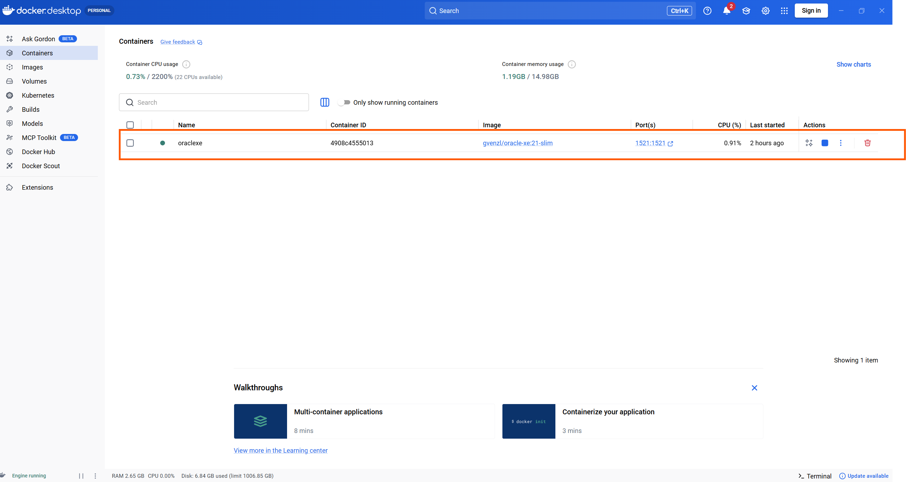
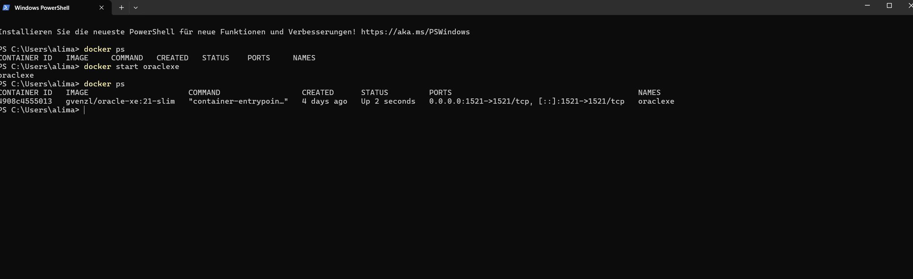
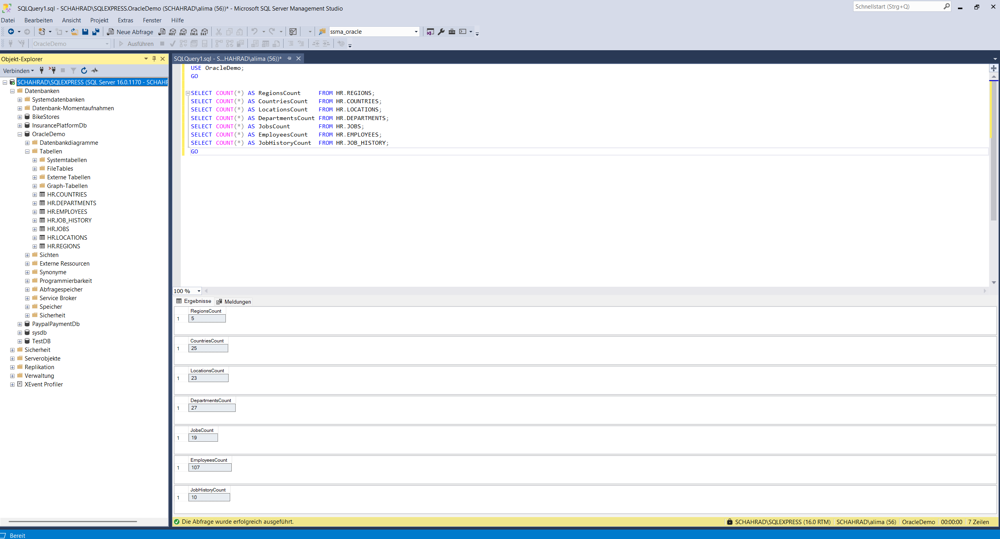

# Oracle to SQL Server Migration Pipeline

A practical portfolio project demonstrating a reproducible migration workflow from **Oracle Database XE** to **Microsoft SQL Server** using **SQL Server Migration Assistant (SSMA)** and **Python-based validation and migration support**.

---
## Overview

This project explores a hands-on database migration scenario from **Oracle** to **SQL Server**. It focuses on the migration of **schema and table data**, along with verification of important structural elements such as:

- tables
- primary keys
- foreign keys
- indexes

To keep the repository safe, reproducible, and suitable for public sharing, the source system is based on the **official Oracle HR sample schema** rather than real business data.

This repository is designed as a **technical portfolio project** that demonstrates migration understanding, tooling familiarity, and structured documentation of a realistic Oracle-to-MSSQL workflow.

The screenshot below shows the Oracle HR sample schema in SSMA and the synchronized SQL Server target schema.

---

## Why This Project Matters

Migration from Oracle to SQL Server is a common enterprise scenario, especially in environments where teams want to reduce platform complexity, standardize on Microsoft technologies, or modernize legacy systems.

In practice, this type of migration involves several technical challenges, including:

- schema conversion between database platforms
- datatype and compatibility differences
- dependency handling
- reliable and repeatable data transfer
- validation of migrated structures and content
- documentation of limitations and unsupported objects

This project was built to document and demonstrate that process in a clear, practical, and transparent way.

---

## What This Project Demonstrates

This repository demonstrates the following skills and concepts:

- setting up an **Oracle XE source database** in Docker
- working with the **Oracle HR sample schema**
- using **SSMA for Oracle** to assess and convert schema objects
- synchronizing converted objects into **Microsoft SQL Server**
- validating migrated tables, keys, and indexes
- organizing a migration proof-of-concept in a reproducible and well-documented form
- separating public demo configuration from real credentials and sensitive data

---

## Architecture / Migration Flow

The migration workflow follows these main phases:

1. Prepare the Oracle source database using Docker and the Oracle HR sample schema
2. Assess the Oracle schema with SSMA
3. Convert supported schema objects for SQL Server
4. Synchronize the converted schema to the target SQL Server database
5. Use Python scripts for migration-related automation and/or validation
6. Verify migrated tables, data, keys, and indexes

### High-Level Flow

Oracle XE / Oracle HR Sample Schema  
→ SSMA Assessment and Schema Conversion  
→ SQL Server Target Schema Synchronization  
→ Python Automation / Validation  
→ Result Review

### Mermaid Diagram

---

## Tech Stack

- Oracle Database XE
- Oracle HR Sample Schema
- Docker
- Microsoft SQL Server
- SQL Server Migration Assistant (SSMA) for Oracle
- Python
- Oracle Client tooling (Oracle Instant Client to support SSMA for Oracle connectivity on Windows)
- SQL 

---

## Source and Target Setup

### Source System

The source database is an Oracle XE instance running in Docker.

The dataset used in this project is based on the official Oracle HR Sample Schema, which provides a realistic but safe schema for public migration experiments and technical demonstrations.

## Source Environment

The Oracle source database runs in Docker to keep the setup reproducible and isolated.

The screenshot below shows the Oracle container running in Docker Desktop.

To verify the running container and port mapping from the command line, the following `docker ps` output was used.

### Target System

The target system is Microsoft SQL Server, which receives the converted schema objects and migrated table data.

---

## Public Repository Safety

This repository intentionally does **not** include:

- real customer data
- internal company databases
- Oracle or SQL Server backup files from real environments
- hardcoded credentials
- production connection strings
- proprietary migration assets

Only example/template configuration files are included where appropriate.

---

## How the Migration Works

### 1. Oracle Source Preparation
An Oracle XE instance is started in Docker and prepared with the Oracle HR Sample Schema.

### 2. SSMA Schema Assessment
SSMA is used to analyze the Oracle schema and highlight compatibility considerations for SQL Server.

### 3. Schema Conversion
Supported Oracle schema objects are converted by SSMA into SQL Server-compatible objects.

### 4. Synchronization to SQL Server
The converted schema is synchronized into the SQL Server target database.

### 5. Data Migration / Automation Support
Python scripts are used to support validation, repeatability, and migration-related workflow steps.

### 6. Validation
The result is checked to confirm that:

- tables were created correctly
- table data was transferred correctly
- primary and foreign keys were preserved
- indexes were created as expected

The following screenshot shows SQL Server validation queries used to verify migrated table counts.

---

## Current Project Status

At the current stage, this project successfully demonstrates:

- migration of tables from Oracle to SQL Server
- successful transfer of table data
- preservation of keys
- preservation of indexes
- documented setup and workflow
- safe, reproducible public demo structure
- use of example configuration in the public repository instead of real local credentials

This repository should be understood as a **migration prototype / portfolio project**, not as a full enterprise-grade migration framework.

---

##  out of scope for the current project phase:

- PL/SQL functions
- stored procedures
- packages
- triggers

This keeps the project scope realistic and technically honest.

---

## How to Run

### Prerequisites

- Docker
- Oracle XE image
- Microsoft SQL Server
- SSMA for Oracle
- Python 3.x
- required Python packages from `requirements.txt`

### Basic Workflow

1. Start the Oracle XE source database
2. Load or prepare the Oracle HR Sample Schema
3. Configure the environment using the example config/template file
4. Run SSMA assessment and schema conversion
5. Synchronize the schema to SQL Server
6. Execute the Python validation / helper scripts
7. Review the migrated structures and validation results

## Repository Scope

This repository focuses on documenting the migration workflow, setup, and validation approach. It does not include real Oracle or SQL Server backup files, internal migration assets, or sensitive environment-specific configuration.

